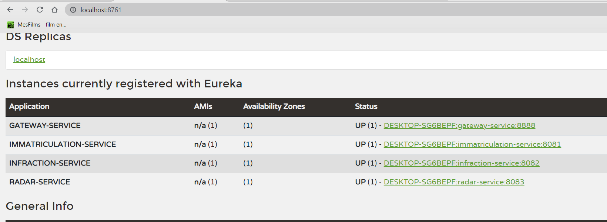
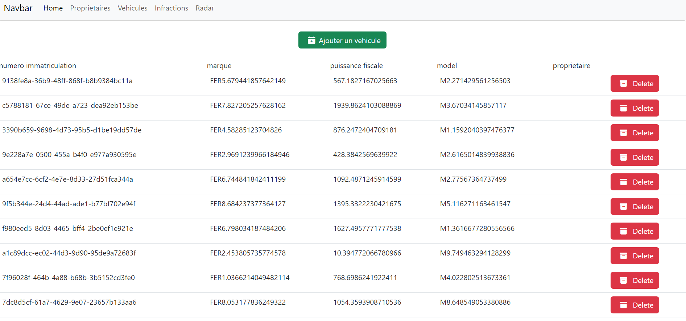

# projet-spring-boot

On souhaite créer un système distribué basé sur les micro-services Cette application devrait
permettre de gérer et d’automatiser le processus des infractions concernant des véhicules 
suites à des dépassement de vitesses détectés par des radars automatiques. Le système se 
compose de trois micro-services :
• Le micro-service qui permet de gérer les radars. Chaque radar est défini par son id, sa 
vitesse maximale, des coordonnées : Longitude et Latitude.
• Le micro-service d’immatriculation qui permet de gérer des véhicules appartenant des
propriétaires. Chaque véhicule appartient à un seul propriétaire. Un propriétaire est 
défini par son id, son nom, sa date de naissance, son email et son email. Un véhicule 
est défini par son id, son numéro de matricule, sa marque, sa puissance fiscale et son 
modèle.
• Le micro-service qui permet de gérer les infractions. Chaque infraction est définie par 
son id, sa date, le numéro du radar qui a détecté le dépassement, le matricule du 
véhicule, la vitesse du véhicule, la vitesse maximale du radar et le montant de 
l’infraction.
En plus des opérations classiques de consultation et de modifications de données, le système 
doit permettre de poster un dépassement de vitesse qui va se traduire par une infraction. En 
plus, il doit permettre à un propriétaire de consulter ses infractions.

## L'interface du serveur eureka

## L'interface de vehicule

